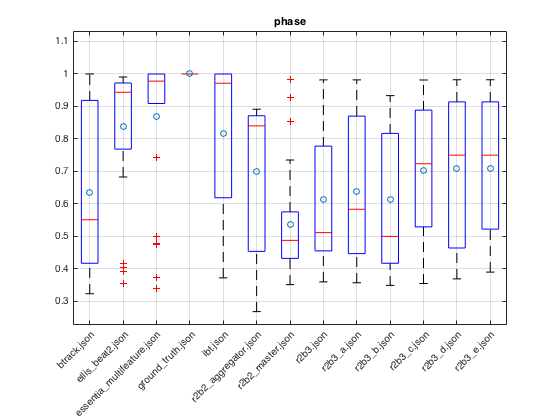

# Plots

I have a lot of work to do here to make it pretty...

1. btrack
2. ellis_beat2
3. essentia_multifeature
4. ground_truth
5. r2b2_aggregator
6. r2b2_master commit: b549300f8d0656210f9bf2c993c1fca91a9f7dcb
7. r2b3 commit: 04acafc05c81bddd744001121b012bbb0cb63a10
8. r2b3_1 changed sum to max for viterbi
9. r2b3_2 did something else...

